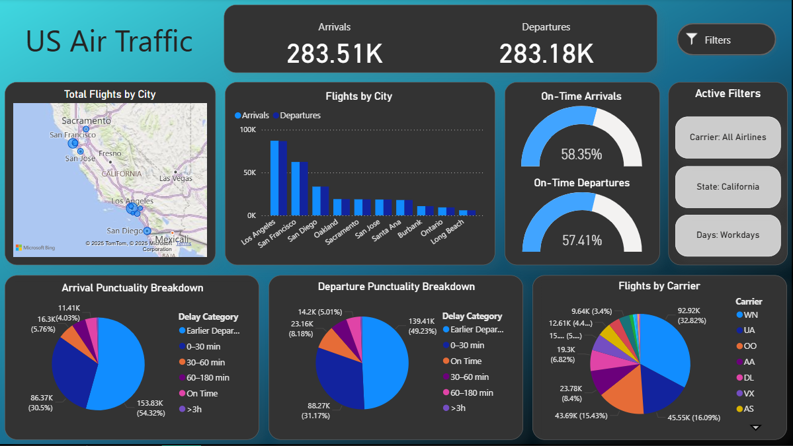
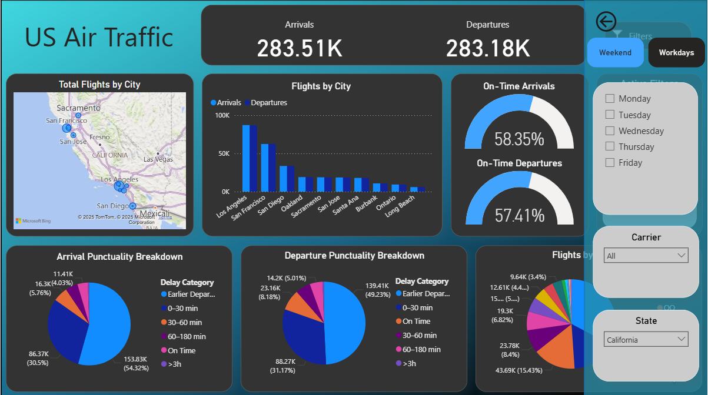

# US_AIR_Traffic_Power_BI_Dashboard
This Power BI dashboard presents an overview of air traffic in the United States. It visualizes the number of arrivals and departures by city, flight punctuality for both arrivals and departures, and the share of flights operated by each airline. Users can filter the data by day of the week, state, and carrier.

## :arrow_down: How to Download and Open:
1. Clone or download this repository:
   ```bash
      git clone https://github.com/Matylda-S/US_AIR_Traffic_Power_BI_Dashboard.git
   
2. Locate the file: US_Air_Traffic_Dashboard.pbix 

3. Open it using Power BI Desktop

4. Explore the dashboard

## 🛠️ Tools
- **Power BI** 
- **Power Query** 
- **DAX** 

## 📊 Dataset
This dashboard uses a dataset available on [Kaggle](https://www.kaggle.com/datasets/tylerx/flights-and-airports-data/data/code).

## 🖥️ Dashboard Preview

### Main Dashboard


### Expanded Filters Panel


## 🖱️ How to Use:

### Filters Panel:
1. Click the **filters button** to open  the filters panel (**hold Ctrl while clicking**). 

2. Click the **arrow button** to  hide the filters panel (**hold Ctrl while clicking**).  

### Map: 
If the map doesn’t dispaly:

1. Go to **File → Options → Security → Use map and filled map visuals.**

2. Refresh the report if needed.

